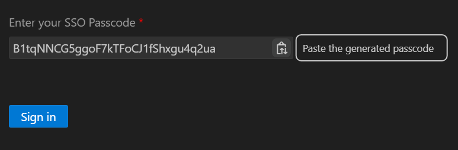

# BIX Portal - CAP Fullstack Application

## 로컬 구동 가이드
### 1. CF Login <br>
1. `ctrl + shift + p` 명령어 파레트 *`CF: Login to Cloud Foundry`* 검색<br>
    <details>
    <summary>스크린 캡쳐</summary>

    
    </details>
2. *`Open a new browser page to generate your SSO passcode`* 클릭
    <details>
    <summary>스크린 캡쳐</summary>

    
    </details>
3. **[최초실행]** Browser 에서 <u>***`afk6q2xhw-platform`***</u> 입력 후 *`Sign in with alternative identity provider`* 클릭
    <details>
    <summary>스크린 캡쳐</summary>

    
    
    </details>
    **[이후실행]** 브라우저 캐시에 이전 로그인 정보가 저장되어 *`본인 계정`* 선택하여 로그인 진행
    <details>
    <summary>스크린 캡쳐</summary>

    
    </details>
4. BTP 로그인 (이미 로그인되어 있으면 생략됨)
5. `passcode` 복사
    <details>
    <summary>스크린 캡쳐</summary>

    
    </details>
6. `passcode` 붙여넣기 후 <u>`Sign in`</u> Cloud Foundry 로그인 진행
    <details>
    <summary>스크린 캡쳐</summary>

    
    </details>
7. **중요** CF `Organization` `Space` 선택 후 *`Apply`* 클릭하여 <u>최종 로그인</u> <br>
    (내 계정이 접근 가능한 Space가 하나일 경우 자동선택 됨)
    <details>
    <summary>스크린 캡쳐</summary>

    
    </details>

### 2. 배포 명령어
#### UI 프론트앤드 배포
> [app/mta.yaml](app/mta.yaml) 설정파일 기반으로 프로젝트 내 프론트 앱(UI5) 배포
- `npm run build:ui` : `mbt` 모듈로 빌드 수행 명령어
- `npm run deploy:card` : `cf` 모듈로 CF 환경 배포 **(CF Login 필수)**
#### 카드(차트, 테이블 등) UI 배포
> [card/mta.yaml](card/mta.yaml) mta.yaml 설정파일 기반으로 카드 컨텐츠 배포 (UI5 Component card)
- `npm run build:card` : `mbt` 모듈로 빌드 수행 명령어
- `npm run deploy:card` : `cf` 모듈로 CF 환경 배포 **(CF Login 필수)**
#### 앱라우터 & 백엔드 배포
> [mta.yaml](mta.yaml) 설정파일 기반으로 프로젝트 내 앱라우터, 백앤드(CAP), 기타 서비스 배포 (HANA DB 배포 포함)
- `npm run build` : `mbt` 모듈로 빌드 수행 명령어
- `npm run deploy` : `cf` 모듈로 CF 환경 배포 **(CF Login 필수)**

### 3. 로컬 실행 명령어
#### 초기 세팅
> `git clone` 이후 프로젝트 초기설정, 로컬 구동(배포,실행)을 위해 npm 모듈 설치
- `npm install` : 루트경로에서 수행
- `npm install --prefix approuter` : 루트경로에서 수행
#### HANA DB 배포
> 빌드 후 배포 진행<br>**([srv/](srv/) 변경 내역 배포는 CAP 어플리케이션 배포 필요)**
- `npm run copy-cdsrc` : **[git clone 후 최초 1회만]** [.gitignore](.gitignore) 로 제외된 환경변수 파일 `.cdsrc-private.json` 복사
- `cds build` : `cds`로 작성한 내용을 hana db artifact 로 빌드 (gen/ 폴더에 빌드)
- `cds deploy` : [gen/](gen/) 폴더에 빌드된 내용을 HANA DB로 배포 (HANA DB 연결정보는 `.cdsrc-private.json` 에 기재)
#### 로컬 구동
> `App Router`(포탈 웹 어플리케이션) 와 `CAP`(Backend API) 두 어플리케이션을 두 개의 터미널창에서 동시에 실행<br>**!! mock / xsuaa 동일하게 실행 !!**
- **Application Router 구동 (localhost:5000)**
    <!-- - `npm run app:mock` : CAP Mock up 유저 인증 환경으로 로컬 구동방식, Mock User는 [package.json](package.json)의 cds 항목에서 제어 (작성 안 할 경우 자동구성) -->
    - `npm run app` : BTP `XSUAA` 인증 적용한 로컬 구동방식 (실제 포탈 인증서비스 로그인 / 구성 전 BTP Subaccount 로그인)
    - `npm run app:server` : 서버 환경의 `CF Runtime` 배포한 CAP API 를 백엔드로 구성하여 로컬 실행 *<u>(CAP 구동은 필요 없음)</u>*
- **CAP node.js 구동 (localhost:4004)**
    <!-- - `npm run cap:mock` : CAP Mock up 유저 인증 환경으로 로컬 구동방식, Mock User는 [package.json](package.json)의 cds 항목에서 제어 -->
    - `npm run cap` : BTP `XSUAA` 인증 적용한 로컬 구동방식 (실제 포탈 인증서비스 로그인 / 구성 전 BTP Subaccount 로그인)

## db/ srv/ 폴더 구조
- **[.cdsrc.json](.cdsrc.json)** 의 항목 중 
```
{
    ...
    "build": {
        "target": "gen",
        "tasks": [
            {
                "for": "hana",      // HANA DB 배포
                "src": "db",
                "options": {
                    "model": [
                        "db",   // 기본값
                        "db/cds/cm",
                        ...     // !! db/cds/ 하위에 별도 폴더 생성시 항목 추가 !!
                        "srv",  // 기본값
                        "srv/cds/cm",
                        ...     // !! srv/cds/ 하위에 별도 폴더 생성시 항목 추가 !!
                    ]
                }
            },
            {
                "for": "nodejs",    // CAP node.js 백엔드 어플리케이션 배포
                "src": "srv",
                "options": {
                    "model": [
                        "db",   // 기본값
                        "db/cds/cm",
                        ...     // !! db/cds/ 하위에 별도 폴더 생성시 항목 추가 !!
                        "srv",  // 기본값
                        "srv/cds/cm",
                        ...     // !! srv/cds/ 하위에 별도 폴더 생성시 항목 추가 !!
                    ]
                }
            }
        ]
    }
}
```

## 프로젝트 구조
| File / Folder<br>(Dev)  | Runtime<br>(Deploy) | Purpose | Description   |
|-------------- | -------------- | -------------- | -------------- |
|**[app/](app/)**| ``HTML5-Repo-Service(Host)`` | **[Frontend]**<br>UI5 Apps     | UI5 App 폴더 각 어플리케이션은 HTML5 Repository 서비스로 ``CF`` 환경에 배포     |
|**[approuter/](approuter/)**<br>[in mta.yaml](mta.yaml#L44)| ``CF App`` Node.js App | **[App Router]**<br>포탈 서비스 진입점| uri 패턴을 정규식으로 파악하여 각 서비스 (CAP, UI5, Destinations(기타 서비스) 등에 라우팅 처리) 와 유저세션, IAS & XSUAA 인증처리 |
|approuter/**[xs-app.json](approuter/xs-app.json)**|*approuter config. file*|**[App Router]**<br>설정파일|<li>앱라우터의 라우팅 패턴(정규식)과 연결할 대상, 대상과 연결할 인증구성(XSUAA, 인증없음 등) 설정<li>첫페이지, 로그인, 로그아웃 경로 구성<li>세션활성시간 등<br><br>[공식문서](http://npmjs.com/package/@sap/approuter)|
|approuter/local/**[xs-app.json](approuter/local/xs-app.json)**|<u>**BAS 로컬구동 Only**</u>||Frontend(UI5), Backend(CAP) 를 로컬파일로 라우팅 할 수 있도록 수정한 앱라우터 구성파일 |
|**[db/](db/)**|``HANA DB`` Artifacts<br>(Table, View...)|**[CAP]**<br>데이터베이스 설계|<li>HANA DB를 대상으로 배포할 데이트베이스 구조 cds 방식으로 설계<li>``cds build`` cds파일 내용을 HANA 언어로 컴파일<li>``cds deploy`` build한 내용을 HANA DB 에 배포|
|**[srv/](srv/)**|``CF App`` JAVA App(Spring)|**[CAP]&[Backend]**<br>CAP oData API 제공 백엔드 앱|<li>``cds``서비스파일에 등록한 서비스를 oData API 형태로 제공<li>각 서비스의 커스텀 로직은 Java의 ``Event Handler`` 로 구현<br>(비즈니스 로직, HANA Native sql 실행하여 프로시저 호출 등)|
|**[.cdsrc-private.json](.cdsrc-private.json)**|<u>**BAS 로컬구동 Only**</u>|``App Router(프론트)`` & ``CAP Java(백엔드)`` & ``cds deploy(DB배포)`` BAS 로컬 환경구동을 위한 설정파일|<li>CF에 배포된 실제 서비스(XSUAA, HDI Container, HTML5-Repo, UI Theme 등)을 로컬환경에서 연결하기 위한 구성파일<li>BAS 에서 CF Login 되어 있는 상태에서만 연결 가능<li>``cds bind --exec <명령어>`` 구조로 앱라우터, CAP JAVA를 실행<br>(필요한 명령어 구성은 package.json > scripts 에 구성)|
|**[.cdsrc.json](.cdsrc.json)**|*cap cds config. file*<br>``Deploy`` & ``Runtime``|**[CAP]&[Backend]**<br>설정파일|<li>DB 타입(HANA, PostgreSQL 등)<li>인증구조(XSUAA, None)<li>그 외 CAP 프로젝트 구성 상세속성<br><br>위 구성들을 profile 별로 구성하여, 로컬개발 / Production(Runtime) 환경 별 구성|
|**[mta.yaml](mta.yaml)**|||[공식문서](https://help.sap.com/docs/btp/sap-business-technology-platform/metadata-for-properties-and-parameters)|
|**[package.json](package.json)**|||<li>db build, deploy 를 처리하는 `cds` npm 모듈<li>``mta`` 빌드, 배포를 위한 npm 종속성 관리<li>``scripts`` 항목에 로컬 개발환경에 사용하는 명령어 조합 등록|
|**[xs-security.json](xs-security.json)**|``XSUAA``|XSUAA 구성파일|<li>BTP Subaccount 에 등록되는 Role 구성<li>XSUAA의 jwt 인증관련 구성 (**중요**: RedirectUri에 BAS 로컬주소나 Approuter 서비스 주소 패턴이 등록되지 않으면 인증처리 되지 않음)<br><br>[공식문서](https://help.sap.com/docs/btp/sap-business-technology-platform/application-security-descriptor-configuration-syntax)|

<!-- |db/**[undeploy.json](db/undeploy.json)**|*cap cds config. file*<br>``Deploy``|**[CAP]**<br>빌드 & 배포 제외대상 관리|동시작업시 다른 cds 구조에 영향을 주지 않기 위해 **제외대상** 등록하여 배포| -->

@최초작성일: 2025. 03. 20
@업데이트: 2025. 05. 12  (v1.1) <br>
@작성자: 제이링크 이금복 매니저
