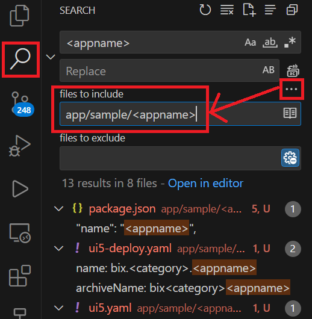

## Sample UI 적용방법
# `<appname>` 폴더를 원하는 위치에 복사
- `app/<category>/` 경로에 복사   <u>예시: app/admin/</u>
# `<appname>` 폴더명을 실제 어플리케이션 명칭으로 변경
- 소문자만 사용
# 어플리케이션 폴더 위치에서 명칭 일괄변경

- `<category>` : app/ 하위 카테고리폴더명 [소문자 only]
- `<appname>` : 어플리케이션 명 (폴더명과 동일 **로컬구동시 필요) [소문자 only]
- `<viewname>` : 앱의 첫 화면 `<appname>`/webapp/view/<u>`<viewname>`</u>.view.xml 파일명 [PascalCase (단어 앞글자마다 대문자)]