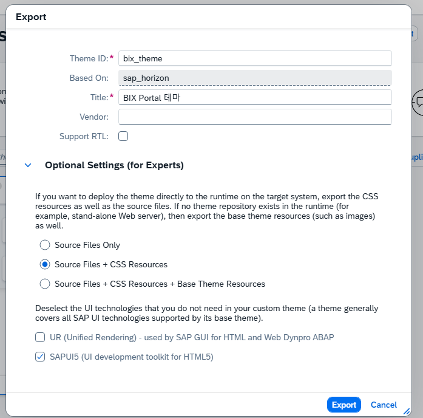

# 테마 적용 가이드

1. BTP 사용자 Theme Designer 권한 확인
1. `<포탈주소>/comsapuitheming.themedesigner/` 주소 접속
1. 테마 Export (옵션값은 사진 참조)
 

1. 압축 파일 BAS에 업로드
1. CLI `unzip` 명령어로 압축 해제
1. UI5 폴더 내부의 sap 폴더만 추출하여 [app/main/webapp/themes/bix_theme](./bix_theme/) 폴더 내부의 sap 폴더 삭제후 교체
1. 정적파일로 테마 사용시 sap_horizon의 아이콘을 제대로 못불러옴 Base 폴더에 아이콘 추가 조치